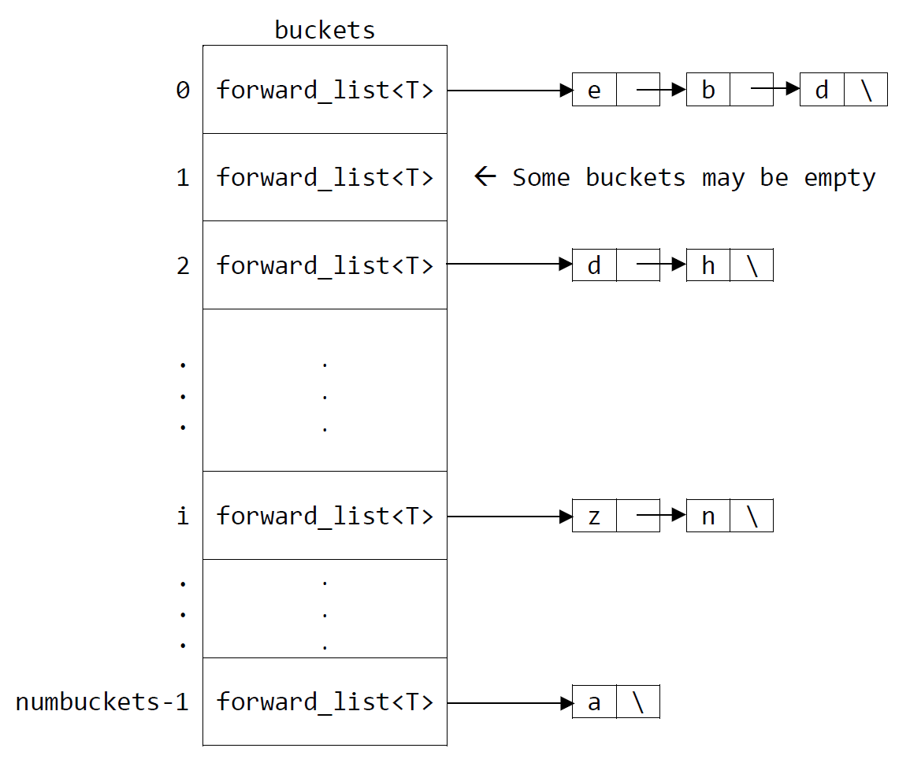

[comment]: <> (Do not remove this!)


> **Note:** It will take 2-5 minutes for the points to update after you push.
>
> **Late Days:** I am using 0 late days

Original assignment by Varick Erickson. Copyright (c) 2021 Varick Erickson.


## Deliverables

| Deliverable                  | Points  |
| ---------------------------- | -------:|
| Add/Contains                 |  5      |
| Remove                       |  5      |
| Assignment/MakeEmpty         |  5      |
| Iterator                     |  5      |
| Overload Add/Remove          |  5      |
| Union                        |  5      |
| Difference                   |  5      |
| Intersection                 |  5      |
| Rehash                       |  5      |
| Questions                    |  15     |
| Commits                      |  5      |
| Commenting                   |  5      |
| **Total**                    | **70**  |

The same standards for committing and commenting apply for this assignment
as previous assignments. You should have pre/post comments in the header
files at minimum as well as general comments.  You should be committing
and pushing regularly.

## Questions (15 points)

1. (1 pt/entry) Complete the following tables of Big-Oh. 

Assume the set has n items and n buckets.

| Function      | Big-Oh (average)    | 
| ------------- | ------------------- |
| Add           | O(1) |
| Remove        | O(1) |
| Contains      | O(n) |

2. (1 pt/entry) Complete the following tables of Big-Oh. 

For the following table, assume set A has n items and set B has m items.
You can also assume that A has n buckets and B has m buckets.  Your answers 
should be written in terms of m and n. (Note there is no difference between 
average, worst, and best for these functions.)

| Function      | Big-Oh              | 
| ------------- | --------------------|
| Union         | O(n) |
| Intersection  | O(n) |
| Difference    | O(n) |
| Assignment    | O(n) |

3. Suppose you used the following function for GetHashIndex().

```c++
int GetHashIndex(const T& elem)
{
    return 0;
}
```

How would this affect the Big-oh for the following functions?

| Function      | Big-Oh (average)    | 
| ------------- | ------------------- |
| Add           | O(1) |
| Remove        | O(1) |
| Contains      | O(n) |

4.  (1pts) Suppose you have n items and k*n buckets.  What would be the load
    factor in this case?

    > n/k*n

5.  (4pts) What would be the optimal number of buckets to have with
    respect to runtime if you have n items?

    > Optimal number of buckets would be n in this case

    
## Recommended Implementation Order

This is the recommend implementation order for the `SetType` class.

1.  `SetType()/SetType(int numBucks)`
2.  `Size()`
3.  `Add(T elem)`
4.  `Contains(T elem)`
5.  `Remove(T elem)`
6.  `MakeEmpty()`
7.  `SetType& SetType=(const SetType& other)`
8.  `SetType& operator+(T elem)`
9.  `SetType& operator-(T elem)`
10. `SetType& operator+(T SetType&)`
11. `SetType& operator-(T SetType&)`
12. `void ResetIterator()`
13. `T GetNextItem()`
14. `Rehash(int newNumBuckets)/LoadFactor()/SetMaxLoad(double max)`

# SetType

For this assignment, you will be implementing a set using an array of link 
lists and a hash function to figure out what "bucket" and element should go 
into.  The set is a template and can store any type. The following is a 
diagram of the data structure (in this instance the T for the forward list 
happens to be a char):



The set stores the elements using an array of singly linked list.  Rather 
than create our own singly linked list, we will use the STL (standard 
template library) `forward_list`.  The next section describes how to use a 
`forward_list` and some examples that will help with your implementation.

# The STL `forward_list`

In industry, you will rarely implement data structures completely from 
scratch.  For common data structures, there are many implementations 
already readily available.  When programming in C++, the most common 
libraries you will use are from the Standard Template Library (STL).  This 
library contains implementations of many common data structures such as trees, 
sets, link lists, etc.

The STL `forward_list` implements a basic singly linked list data structure.
This section describes several functions from the `forward_list` that you 
will need in order to implement your `SetType` data structure.  The 
`forward_list_examples.cpp` file shows some usage of this data structure.

### Pushing an element on a `forward_list`

To add en element to the front of a `forward_list`, you can use the 
`push_front` function.

```c++
forward_list<int> mylist;  // mylist is a singly linked list of integers

mylist.push_front(42);  // This adds 42 to the front of myList
```

### Removing elements from a `forward_list`

To remove en element from a `forward_list`, you can use the
`remove` function.

```c++
mylist.remove(42);  // This removes 42 from mylist
```

### Iterating over a `forward_list`

Iterating over a `forward_list` is a bit different than what you are used to.
The STL libraries like the `forward_list` make use of iterator objects.  The 
iterator object points to specific element in a data structure.  In 
previous projects, we created a "ResetIterator" function to have the 
iterator start at the beginning of the data structure.  For the `forward_list`,
we create an iterator object using the `forward_list` that starts at the 
beginning of the list:

```c++
forward_list<T>::iterator it; // Creates an iterator object

it = mylist.begin();          // Initialize the iterator object to the 
                              // beginning of mylist
```

If we want to examine the current element that the iterator points to, then we 
dereference the iterator object:

```c++
forward_list<T>::iterator it; // Creates an iterator object called "it"

it = mylist.begin();          // Initialize the iterator object to the 
                              // beginning of mylist

// Notice we dereference the iterator object to access the iterator value.
cout << "This is the first item: " << *it << endl;   

it = mylist.end();            // Initialize the iterator to the end of mylist
cout << "This is the last item: " << *it << endl;
```

If we want to get the next item in the iterator, then we use the pre or post 
incrementer operator:

```c++
forward_list<T>::iterator it; // Creates an iterator object

it = mylist.begin();          // Initialize the iterator object to the 
                              // beginning of mylist
                              
cout << "This is the first item: " << *it << endl;
it++;   // Move to the next item in iterator

cout << "This is the second item: " << *it << endl;
```

A common construction for iterating through the entire `forward_list` would 
be to use a for loop:

```c++
for (it = mylist.begin(); it != mylist.end(); ++it )
    cout << ' ' << *it;
cout << '\n';
```

Notice, we don't use a size or length to control the loop.  In fact, the 
`forward_list` class does not have size function as part of the class. We 
instead check to see if the iterator object is at the end of the data 
structure using the member function `end()` of the `forward_list` object.

### Clearing a `forward_list`

To clear a `forward_list`, you simply call the function clear.  This will 
remove all the elements from the list.
```c++
mylist.clear();     //  Removes all items from the forward_list
```

# SetType Descriptions

## `Basic_SetType_Test.cpp`

The `Basic_SetType_Test.cpp` can be used for development.  It will not be used
for grading. This program does several very basic tests of SetType.  It is 
useful starting point for testing your SetType.  Feel free to modify this 
file as part of your testing.

> **Note:** This program is a CMake Application.  It will not show up
> as a Catch Application.

## `SetType() Default Constructor`

The default constructor should use the default number of buckets and set the 
number of elements to 0.

## `SetType(numBucks)`

This constructor should uses the `numBucks` to create the buckets and set the
number of elements to 0.

## `Size()`

This function returns the total number of elements in the set.

## `Add(T elem)`

This function should add `elem` to the set.  If `elem` already exists in the 
list, then the set should not change.  This function should use the 
`GetHashIndex` to figure out what bucket `elem` should be placed and the `elem`
should be pushed to the front of the forward_list.

The following is some code that shows how to find a bucket index.
```c++
// How to figure out the bucket an element should go into
int bucket = GetHashIndex(elem);
```

If the load factor is above the `maxLoad`, then the number of buckets 
needs to be doubled and `Rehash` should be called.

> **HINT:** I recommend waiting to add the `Rehash` call until later. Don't 
> forget about book keeping.

## `Remove(T elem)`

This function should remove `elem` to the set.  If `elem` already exists in the
list, then the set should not change.  This function should use the
`GetHashIndex` to figure out what bucket `elem` exists in and remove 
`elem` from the forward list.

## `void MakeEmpty()`

The `MakeEmpty` function should remove all elements from the set.  This is 
done by clearing each bucket.

> **Hint:** Loop over the buckets.

## `SetType operator+(T elem)`

This is an alternative way to add an element to a set.  However, this 
overload does ***not*** change the original calling set.

```c++
SetType<char> setA;
SetType<char> setB;

// setA will contain {a, b, c, d}
for (char c = 'a'; c < 'e'; c++) {
   setA.Add(c);
}

setB = setA + 'e';  // setB will contain {a, b, c, d, e}
                    // setA will still contain {a, b, c, d}
```

> **HINT:** You can use the Add function and the assignment operator to help 
> implement this overload.

## `SetType operator-(T elem)`

This is an alternative way to remove an element to a set.  However, this
overload does ***not*** change the original calling set.

```c++
SetType<char> setA;
SetType<char> setB;

// setA will contain {a, b, c, d}
for (char c = 'a'; c < 'e'; c++) {
   setA.Add(c);
}

setB = setA - 'a';  // setB will contain {b, c, d}
                    // setA will still contain {a, b, c, d}
```

> **HINT:** You can use the Remove function and the assignment operator to help
> implement this overload.

## `SetType operator+(SetType& otherSet)`

This function returns the union of `this` and `otherSet`. This overload
does ***not*** change the original instance or `otherSet`.

```c++
SetType<char> setA;
SetType<char> setB;
SetType<char> unionAB;

// setA will contain {a, b, c, d}
for (char c = 'a'; c < 'e'; c++) {
   setA.Add(c);
}

// setB will contain {e, f, g, h}
for (char c = 'e'; c < 'i'; c++) {
    setB.Add(c);
}

unionAB = setA + setB;  // unionAB will contain {a, b, c, d, e, f, g, h}
                        // Note that setA and setB will be unchanged.
```

## `SetType operator-(SetType& otherSet)`

This function returns the difference of `this` and `otherSet`. This overload 
does ***not*** change the original instance or `otherSet`.

### Order matters for difference

Unlike union, order matters.  If you have sets A and B, A - B will produce a 
different result than B - A.

> **Example:**  
> Let A = {a, b, c, d} and B = {b, d, e}.  Then 
> 
> A – B = {a, c}
> 
> and
> 
> B – A = {e}.

> **Example:**
> Let G = {a, b, c} and H = {a, b, c}. Then G – H = {}.

```c++
SetType<char> setA;
SetType<char> setB;
SetType<char> diffAB;
SetType<char> diffBA;

// setA will contain {a, b, c, d}
for (char c = 'a'; c < 'e'; c++) {
   setA.Add(c);
}

// setB will contain {b, d, e}
setB.Add('b');
setB.Add('d');
setB.Add('e');


diffAB = setA - setB;  // diffAB will contain {a, c}
diffBA = setB - setA;  // diffBA will contain {e}

// Note that setA and setB will be unchanged.
```

## `SetType operator*(SetType& otherSet)`

This function returns the intersection of `this` and `otherSet`. This overload
does ***not*** change the original instance or `otherSet`.

```c++
SetType<char> setA;
SetType<char> setB;
SetType<char> intersectAB;

// setA will contain {a, b, c, d}
for (char c = 'a'; c < 'e'; c++) {
   setA.Add(c);
}

// setB will contain {b, d, e}
setB.Add('b');
setB.Add('d');
setB.Add('e');

intersectAB = setA*setB;  // intersectAB will contain {b, d}

// Note that setA and setB will be unchanged.
```

## `SetType& operator=(SetType const& otherSet)`

This function does a deep copy into `this`.  The function should copy the 
contents of each bucket from `otherSet` into the buckets of `this`.  The 
function should also copy over the appropriate private variables from 
`otherSet` to `this`.

> **HINT:** Be sure that the number of buckets match.  You will need to 
> delete `buckets` and reallocate the correct number of buckets similar how 
> you allocated the buckets for the constructor. Be also sure to make `this` 
> empty before copying the elements from `otherSet`.

## `void Rehash(int newNumBuckets)`

This function rehashes the elements stored in the set using the `newNumBuckets`.

A simple strategy is to start with an empty set with the 
appropriate number of buckets (let's call this `rehashSet`).  After that, you 
can use the iterator to add all the elements from `this` to the `rehashSet`. 
Once all the elements are copied into the `rehashSet`, you can use the 
assignment operator with `*this` and `rehashSet`.

## Variables used for the SetType iterator

Two variables are used to keep track of the current element that should be 
returned next; `currBucket` and `bucketIter`.  The `currBucket` is the index 
of the bucket that is currently being iterated over.  The `bucketIter` is 
the iterator of the bucket currently being iterated over.  A third variable 
called `iterCount` is used to determine how many iterations have occurred.  
This variable is used to throw an error if we try to get the next item when 
there is no more items to iterate over.

## `void ResetIterator()`

This function resets the iterator for the set.  It behaves similarly to the 
other data structures covered previously.  This function should set 
`bucketIter` to the beginning of the first bucket.  It should also set 
`currBucket` and `iterCount` appropriately.

## `T GetNextItem()`

This function should return the element that the `bucketIter` currently points 
to and then increment the `bucketIter`.  If there are no more elements in 
the `bucketIter` (it is at the end), then the `currBucket` should be 
incremented and `bucketIter` should be set to the beginning of the next bucket.  
If `GetNextItem()` is called and there are no more elements to iterate over, 
then it should throw a `IteratorOutOfBounds` error.

Here is a rough algorithm:

```c++
If there are no more elements (use iterCount)
   throw a SetError
   
// Find the first bucket that actually has something in it   
while bucketIter is not at end
   set bucketIter to the next bucket and increment currBucket
   
Increment bucketIter
Increment iterCount

return 
```

> **HINT:** You should be using `end()` to check if you are at the end of a 
> bucket.
